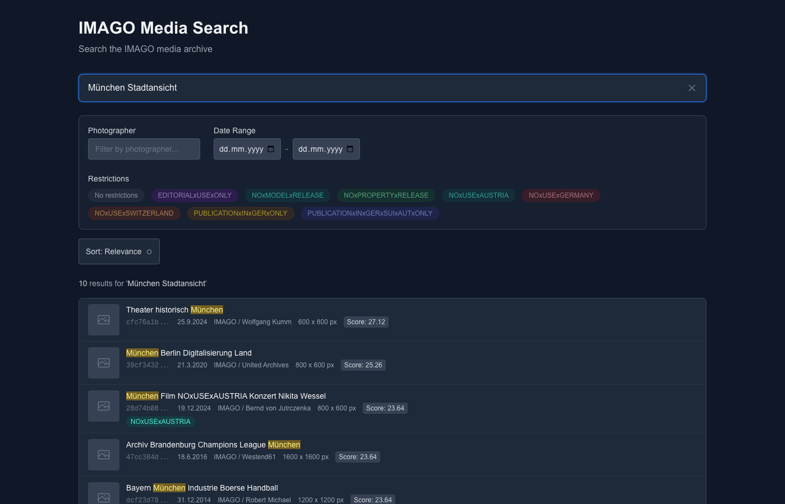

# IMAGO Media Search

A full-text search interface for media metadata with BM25 relevance scoring, advanced filtering, and a modern dark-mode UI. Built as a demonstration of search system design for the IMAGO coding challenge.



**Live Demo:** [imago-coding-challenge-i3f9.vercel.app](https://imago-coding-challenge-i3f9.vercel.app/)

**Technical Documentation:** [Architecture, Scoring, and Scaling (PDF)](./public/architecture.pdf)

## Features

- **Full-text search** with BM25 relevance scoring
- **Multi-field search** across descriptions, photographer names, and IDs
- **Filters:** photographer, date range, restrictions
- **Keyword highlighting** in search results
- **Pagination** with configurable page size
- **Sorting** by relevance or date
- **Dark mode** UI with responsive design

## Getting Started

### Prerequisites

- Node.js 18+
- npm

### Installation

```bash
npm install
```

### Running Locally

**Development mode:**
```bash
npm run dev
```
Open [http://localhost:3000](http://localhost:3000)

**Production build:**
```bash
npm run build
npm run start
```

### Data Generation (Optional)

The repository includes pre-generated sample data (10,000 items). To regenerate:

```bash
npm run generate-data
```

## Tech Stack

- **Framework:** Next.js 15 (App Router)
- **Language:** TypeScript
- **Styling:** Tailwind CSS v3
- **State Management:** nuqs (URL state)
- **Search:** Custom in-memory inverted index with BM25

## Project Structure

```
src/
  app/
    api/
      search/     # Search endpoint with filtering/pagination
      filters/    # Filter options (photographers, restrictions)
    page.tsx      # Main search UI
  lib/
    search/       # Inverted index, BM25, tokenizer
    data/         # Preprocessing, data loading
    api/          # Highlighting, analytics
  components/     # React UI components
```

## Approach

The search system uses a **custom inverted index** with **BM25 scoring** - the same ranking algorithm used by Elasticsearch and Lucene. Each searchable field (description, photographer, ID) has its own index with configurable weighting.

**Preprocessing** handles dirty German metadata: normalizing umlauts (a -> ae), parsing European dates (DD.MM.YYYY -> ISO), and extracting restriction tokens embedded in text.

**Prefix matching** with binary search allows partial word matches with a configurable score penalty. The architecture is designed to scale from the current in-memory implementation to Redis or Elasticsearch as data grows.

For detailed technical documentation including the BM25 formula, preprocessing pipeline, and scaling strategy, see the [Architecture PDF](./public/architecture.pdf).

## Assumptions and Limitations

- **In-memory index:** Works well for 10k items; would need persistence for millions
- **German-focused:** Umlaut normalization and date formats assume German data
- **Static data:** Index rebuilds on cold start; no incremental updates
- **Single instance:** No index sharing across serverless functions (acceptable for demo scale)

---

Built for the IMAGO coding challenge
